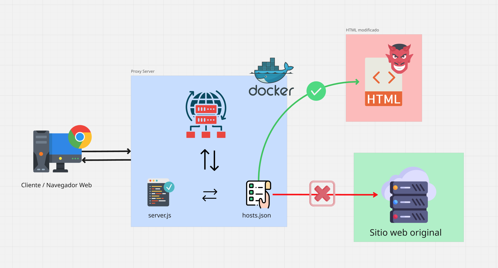
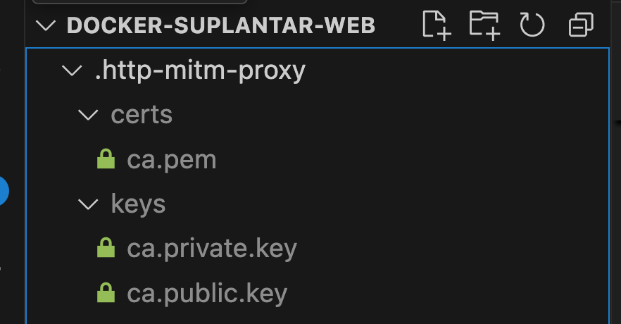
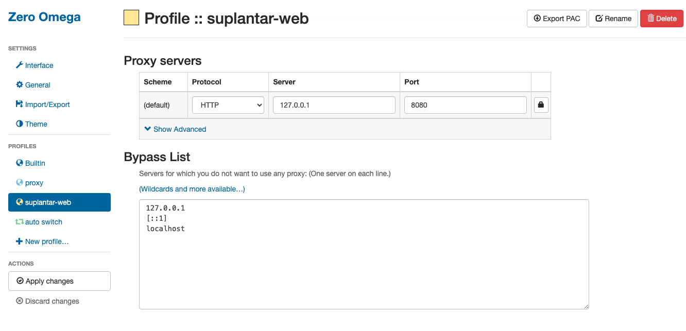

# Suplanta cualquier sitio web



Este proyecto proporciona un proxy HTTP/S basado en Node.js que utiliza MITM (Man-in-the-Middle) para interceptar y modificar tráfico web. Está empaquetado con Docker y docker-compose para facilitar su despliegue.

## Características

- **Interceptación HTTP/S**: Utiliza la librería `http-mitm-proxy` para desencriptar y reencriptar tráfico HTTPS.
- **Redirección de hosts**: Permite mapear peticiones de dominios específicos a archivos o páginas locales.
- **Contenedor ligero**: Basado en `node:18-alpine` para un footprint mínimo.
- **Configuración por entorno**: Variables definidas en un archivo `.env`.

## Requisitos

- [Docker](https://www.docker.com/) instalado.
- [Docker Compose](https://docs.docker.com/compose/) instalado.
- Puertos libres (por defecto `8080`).

## Estructura del proyecto

```plaintext
/docker-suplantar-web
├── server.js               # Servidor principal del proxy
├── Dockerfile              # Imagen Docker basada en node:18-alpine
├── docker-compose.yml      # Definición del servicio para Docker Compose
├── package.json            # Dependencias y scripts NPM
├── .env.example            # Ejemplo de variables de entorno
├── hosts.json.example      # Ejemplo de mapeo host -> archivo local
├── .gitignore              # Archivos y carpetas ignorados por Git
├── README.md               # Documentación del proyecto
├── html                    # Páginas locales para dominios interceptados
```

## Instalación y uso

**1. Crear los archivos de configuración:**

```bash
cp .env.example .env
cp hosts.json.example hosts.json
```

**2. Editar `.env`:**

Define el puerto donde escuchará el proxy:

```bash
PROXY_PORT=8080
```

**3. Configurar `hosts.json`:**

Mapea dominios a rutas de archivos locales:

```bash
[
    {
        "host": "https://www.youtube.com", # URL de la web suplantar
        "file": "youtube.html" # Nombre del archivo dentro de la carpeta html que renderizara el Proxy
    }
]
```

**4. Construir y levantar el proxy:**

Con Docker Compose:

```bash
docker compose up --build -d
```

**5. Instala los certificados:**

Instala los certificados en tu ordenador para que el tráfico redirigido por el proxy sea catalogado como seguro.



**6. Configurar el cliente:**

Ajusta tu navegador o dispositivo para usar `http://<host>:${PROXY_PORT}` como proxy HTTP y HTTPS.



## Personalización

- **Añadir nuevos hosts**: Edita `hosts.json` y agrega entradas.
- **Páginas clonadas**: Coloca archivos HTML el la carpeta `html/`.
- **Confianza de certificados**: Instala los CA generados en `.http-mitm-proxy/` en tu sistema.

## 👨‍💻 Autor

Desarrollado por [Alejandro Robles | Devalex ](http://devalexcode.com)  
¿Necesitas que lo haga por ti? ¡Estoy para apoyarte! 🤝 https://devalexcode.com/asesoria

¿Dudas o sugerencias? ¡Contribuciones bienvenidas!
